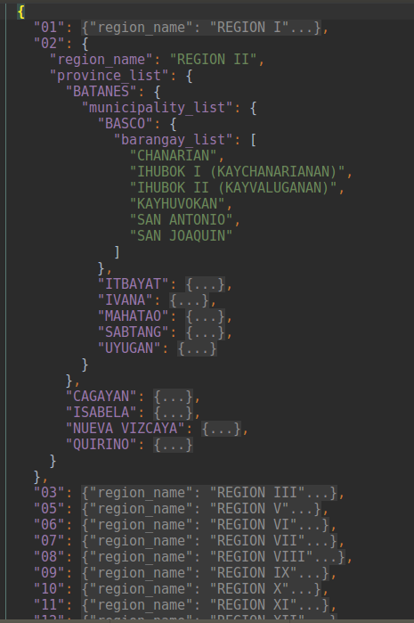

# List of Philippine Regions, Provinces, Cities, Municipalities, and Barangays

### Download
Get the version 4(2019v2) file here: [philippine_provinces_cities_municipalities_and_barangays_2019v2.json](./philippine_provinces_cities_municipalities_and_barangays_2019v2.json?raw=true)

### How to use, and notes on format

The file is in json format, and should be accessible to most languages. For python users, it can be loaded using the json library.

```python
import json
with open("/path/to/file/philippine_provinces_cities_municipalities_and_barangays_2019v2.json") as myjsonfile:
    mydata = json.load(myjsonfile)  
```
An overview of the structure:        


Region keys are of the string values "01", "02", "03", "4A", "4B, "05", "06", "07", "08", "09", "10", "11", "12", "13", "BARMM", "CAR", "NCR", (including "NIR" for version 2, and ARMM for version 3 and 3.1).

1. Each region has the following properties: 

    1. A "region_name" property which maps to a string
        - example: `"region_name": "REGION XIII"`
    2. A "province_list" property which maps to a dictionary that has the province name in all caps as the keys
        - example: `"province_list": { BATANGAS:{ ... }, "CAVITE":{ ... },  ... }` 
2. Each province has the following property:
    1. A "municipality_list" which maps to a dictionary containing municipality names in all caps as the keys
        - example: `"municipality_list": { "BACOLOD CITY": { ... }, "BAGO CITY": { ... },  "BINALBAGAN" { ... }, ...}` 
3. Each municipality has the following property:
    1. A "barangay_list" which maps to a list containing the barangay names
        - example: `"barangay_list": ["AMPUCAO", "DALUPIRIP", "GUMATDANG", ...]`
        
### What is this?

This is a nested list  of Philippine regions, provinces, cities/municipalities and barangays in json format.

### Why?

Getting an authoritative list of Philippine geographical areas can be pretty tedious and challenging.

### Is this accurate?

Short answer: Yes, it is accurate.

Long answer:
- It was definitely accurate as of 13 May 2019, the date of the 2019 Philippine elections. Or at least, it was as 
accurate as the COMELEC records for that election.
- The only warning we have for this resource is that if any municipalities or barangays have either been created, 
renamed, moved, or destroyed since the 2019 elections, such changes would not be reflected on this resource. If you know
of any such changes, please file an issue, or better yet, make a pull request, so that we can have it fixed.

### Any changes from the version 3 file I should know about?
Several municipalities have been renamed, some barangays have been moved, and some barangays not present in the previous
version have been introduced.  ARMM has also been changed to BARMM.  Running a diff between the properly formatted version 
3.1 (2017) and [version 4 (May 15, 2019v1)](./philippine-regions-provinces-cities-municipalities-barangays/0ae4a49d3d5e5e1749575a1d028da6dac4020b35/philippine_provinces_cities_municipalities_and_barangays_2019.json?raw=true) 
(prior to the correction of Ñ characters on July 29, 2019),  should show which portions have changed (there should be 
around 14 material differences).

### So which version should I get?
Get the version 4 (2019v2) file. [philippine_provinces_cities_municipalities_and_barangays_2019v2.json](./philippine_provinces_cities_municipalities_and_barangays_2019v2.json?raw=true)

### I've spotted some inaccuracies!
Please file an issue or make a pull request. I can also be reached at the email address associated with this github account.

### Obligatory disclaimer
Data is provided as is and without guarantees.  It should however be fairly accurate, as it is based on the 2019 Comelec 
election data.